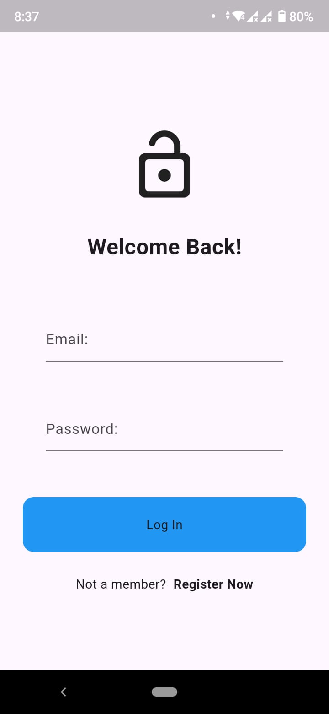

# Flutter Auth App 🚀

This is a **Flutter Authentication App** implementing a clean architecture pattern using **Cubit (State Management)** and Firebase authentication.

## 📁 Project Structure
The project follows a **feature-based folder structure** with **clean architecture principles**:

```
lib/
│── features/
│   ├── auth/
│   │   ├── data/  
│   │   │   ├── models/  
│   │   │   │   ├── firebase_app_user.dart  
│   │   │   ├── repositories/  
│   │   │   │   ├── firebase_app_user_repo.dart  
│   │   ├── domain/  
│   │   │   ├── entities/  
│   │   │   │   ├── app_user.dart  
│   │   │   ├── repositories/  
│   │   │   │   ├── app_user_repo.dart  
│   │   ├── presentation/  
│   │   │   ├── cubits/  
│   │   │   │   ├── auth_cubit.dart  
│   │   │   │   ├── auth_state.dart  
│   │   │   ├── pages/  
│   │   │   │   ├── auth_page.dart  
│   │   │   │   ├── login_page.dart  
│   │   │   │   ├── register_page.dart  
│   │   │   ├── widgets/  
│   │   │   │   ├── my_button.dart  
│   │   │   │   ├── my_text_field.dart  
│── home.dart  
```

---

## 🔧 Features
✅ User Registration ✨  
✅ User Login 🔐  
✅ Firebase Authentication Integration 🔥  
✅ Clean Architecture (Data, Domain, Presentation)  
✅ Bloc/Cubit for State Management  

---

## 🛠️ Tech Stack
- **Flutter** (Frontend UI)  
- **Dart** (Programming Language)  
- **Firebase Authentication** (Backend for Auth)  
- **Cubit (Bloc)** (State Management)  

---

## ⚙️ Installation & Setup

1️⃣ **Clone the Repository**  
```sh
git clone https://github.com/Praphulla06/flutter-auth-app.git
cd flutter-auth-app
```

2️⃣ **Install Dependencies**  
```sh
flutter pub get
```

3️⃣ **Setup Firebase**  
- Go to [Firebase Console](https://console.firebase.google.com/)  
- Create a Firebase project  
- Add your **google-services.json** (for Android) and **GoogleService-Info.plist** (for iOS)  

4️⃣ **Run the App** 🚀  
```sh
flutter run
```

---

## 📷 Screenshots



---

## 📌 Contribution
Feel free to fork, improve, and make a pull request! 🚀  

---

## 📜 License
This project is **MIT Licensed**.

